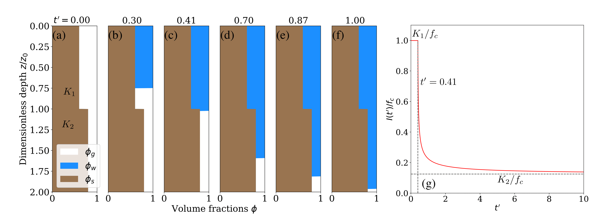

# Infiltration on early Mars

## Authors
- Mohammad Afzal Shadab (mashadab@utexas.edu)
- Eric Hiatt
- Rickbir Singh Bahia
- Eleni V. Bohacek
- Vilmos Steinmann
- Marc Andre Hesse (mhesse@jsg.utexas.edu)

## Corresponding author affiliations (Email provided)
Oden Institute for Computational Engineering and Sciences / Jackson School of Geosciences / University of Texas Institute for Geophysics
The University of Texas at Austin

## 4-line Summary
The codes provide the analytical solutions for infiltration in soils with two-layer and power-law porosity decay profiles on early Mars. The results have been validated with numerical solver and Hydrus simulations. The codes given correspond to the figures from the research paper. Lastly, we provide results for infiltration times on the southern highlands in the presence of a global groundwater table.

Figures: (a-f) Infiltration in double-textured soil due to excess supply of water. (g) Evolution of dimensionless infiltration rate I/fc (or transmission loss). The volume fraction `φ_α` is the volume ratio of each phase α: gas (g), water (w), and regolith (s).

Figures: Infiltration on early Mars. (a) Difference between topography and groundwater table elevation. (b) Infiltration time contour: Time to reach the water table in a homogeneous crust (megaregolith).

## Citation
[1] Shadab, M.A. and Hesse, M.A., 2022. Analysis of Gravity‐Driven Infiltration With the Development of a Saturated Region. Water Resources Research, 58(11), p.e2022WR032963.

[2] Shadab, M., Hiatt, E., Hesse, M., 2023. Investigating groundwater dynamics and residence times on early mars using unconfined
aquifer model with vertical heterogeneity. LPI Contributions 2806, 1736.

[3] Shadab, M.A., Hiatt, E., Hesse, M.A., 202X. Investigating groundwater dynamics and residence times on early mars using
unconfined aquifer model with vertical heterogeneity. (under preparation) .

## Getting Started
### Dependences
The python codes for Figures 1 and 2 require the following packages to function:
- [Python](https://www.python.org/) version 3.5+
- [Numpy](http://www.numpy.org/) >= 1.16
- [scipy](https://www.scipy.org/) >=1.5
- [matplotlib](https://matplotlib.org/) >=3.3.4

Figure 3 is obtained from MATLAB.

### Quick Usage
After cloning the repository and installing the required libraries, run the python files corresponding to the figure numbers as given in the paper. Codes can be run either directly or on an IDE such as Anaconda Spyder. The resulting plots are collected in the folder `Figures`. MATLAB code be run directly.

### Non-dimensionalization
The depth coordinate `z` is scaled with characteristic length `z_0`, time is scaled with characteristic time `z_0/f_c` and infiltration rate `I(t)` (or volumetric flux) is scaled with the infiltration capacity `f_c`. Therefore, the dimensionless variables are `z'=z/z_0`, `t'=tf_c/z_0`, and $`f'=I(t)/f_c`$.
